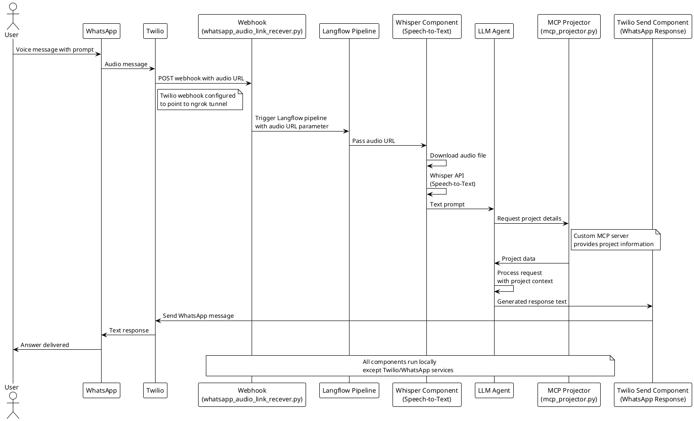

# "I know what I did last summer" Langflow agent.

Langflow-based agent that keeps track of my personal projects.

Implemented as a project for "Hacking Agents" Hackathon, sponsored by Langflow, Twilio, Mistral, Eleven Labs (London, Jun 2025).

**IT IS A POC. NOT FOR PRODUCTION USE**

The workflow is triggered by WhatsApp voice message.

It can:

- **Find projects and notes** by verbal description, e.g. "What have I done to get driving license?" returns list of actions with dates.
- **Create new projects.** E.g. "I'm about to find a good present for my uncle's birthday" will create project folder with README.md file in it, containing concise and accurate title and applicable keywords.

## System Architecture

Next steps:

- Return details from project notes.
- Download and search archived projects.

## Implementation details

- MCP for searching and creating projects
- Custom component for turning audio into text and processing via LLM (Whisper-based)
- Custom component for returning text responses via WhatsApp (Twilio-based)
- Versions for OpenAI and Mistral LLMs are available